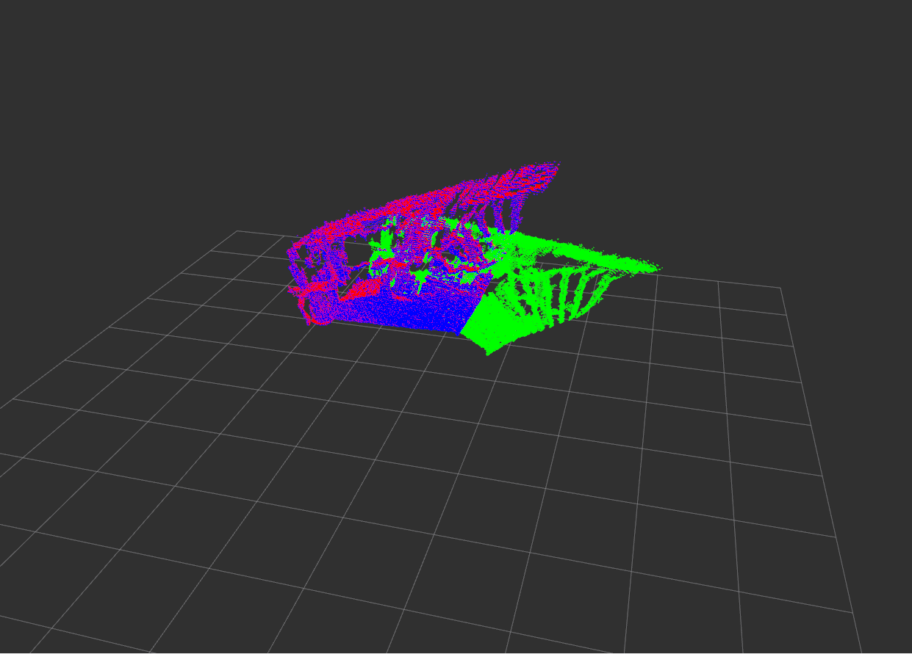
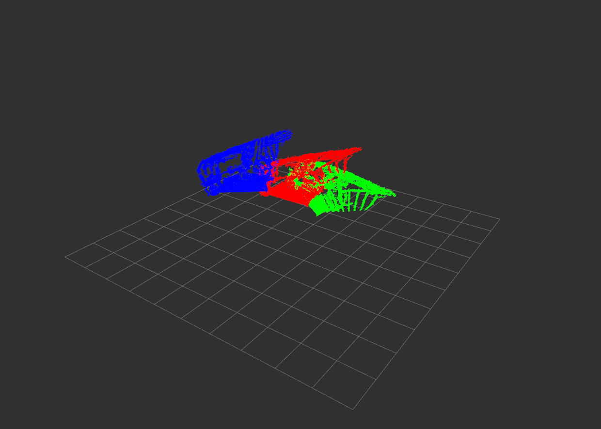

# PCD_Registration

This is a ros package that register 2 pointclouds with using either Generalized Iterative Closest Point, which is I recommend, or Normal Distrubiton Transform algorithms.

## Requirements
- [ROS2 Foxy](https://docs.ros.org/en/foxy/Installation/Ubuntu-Install-Debians.html)
- [PCL Library](https://pointclouds.org/downloads/)

## Build

```
cd ${workspace}/src
git clone https://github.com/yvzksgl/PCD_Registration.git
cd $[workspace}
colcon build
source install/setup.bash
```

## Launch
You may want to change algorithm that will be applied. To do that you need to alter launch file.
```
parameters=[{"input_pcd1_path":"data/capture0001.pcd"},
                        {"input_pcd2_path":"data/capture0002.pcd"},
                        {"out_pcd_path":"data/transformed.pcd"},
                        {"algorithm": "gicp"}]
```
Only "gicp" and "ndt" allowed for algorithm parameter. To launch program as pre-configured:
```
ros2 launch pcd_reg pcd_reg.launch.py
```
## Results
Both of the results, green illustrates source pointcloud, red illustrates target pointclud and blue illustrates output pointcloud. GICP works pretty good but NDT failed at my implementation. It can be enhanced by parameter tuning but it makes NDT very slow in my case. solution may be find in the future. 
- GICP

- NDT

